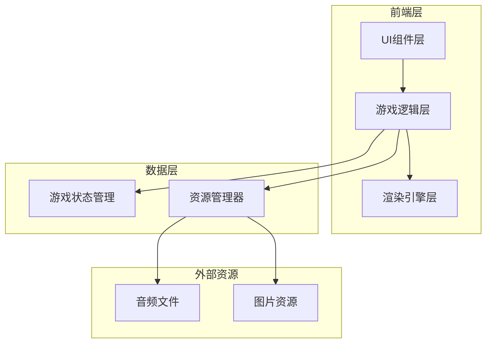

## 1. 架构设计



## 2. 技术说明

- **前端框架**: React@18 + TypeScript
- **样式方案**: Tailwind CSS@3
- **构建工具**: Vite
- **游戏渲染**: Canvas 2D API
- **状态管理**: React useState + useReducer
- **音频处理**: Web Audio API
- **初始化工具**: npm create vite@latest

## 3. 路由定义

| 路由 | 用途 |
|-----|------|
| / | 主菜单页面 |
| /game/:mapId | 游戏场景页面，mapId为地图ID(1或2) |
| /result | 游戏结算页面 |

## 4. 核心模块设计

### 4.1 游戏引擎模块
```typescript
interface GameEngine {
  canvas: HTMLCanvasElement;
  ctx: CanvasRenderingContext2D;
  towers: Tower[];
  monsters: Monster[];
  projectiles: Projectile[];
  gameState: GameState;
  start(): void;
  pause(): void;
  update(deltaTime: number): void;
  render(): void;
}
```

### 4.2 炮台模块
```typescript
interface Tower {
  id: string;
  type: TowerType;
  x: number;
  y: number;
  level: number;
  attackPower: number;
  attackRange: number;
  attackInterval: number;
  lastAttackTime: number;
  target: Monster | null;
}

type TowerType = 'fire' | 'ice' | 'lightning';
```

### 4.3 怪物模块
```typescript
interface Monster {
  id: string;
  type: MonsterType;
  x: number;
  y: number;
  hp: number;
  maxHp: number;
  speed: number;
  pathIndex: number;
  isDead: boolean;
  isSlowed: boolean;
  slowEndTime: number;
}

type MonsterType = 'slime' | 'goblin' | 'skeleton' | 'golem' | 'shadow' | 'boss';
```

### 4.4 地图模块
```typescript
interface GameMap {
  id: number;
  name: string;
  background: string;
  path: Point[];
  towerSlots: Point[];
}

interface Point {
  x: number;
  y: number;
}
```

### 4.5 游戏状态模块
```typescript
interface GameState {
  gold: number;
  lives: number;
  currentWave: number;
  totalWaves: number;
  isPlaying: boolean;
  isPaused: boolean;
  selectedTower: TowerType | null;
  result: 'win' | 'lose' | null;
}
```

## 5. 项目目录结构

```
tower-defense/
├── src/
│   ├── components/
│   │   ├── Menu/
│   │   │   ├── MainMenu.tsx
│   │   │   ├── MapSelect.tsx
│   │   │   └── Settings.tsx
│   │   ├── Game/
│   │   │   ├── GameCanvas.tsx
│   │   │   ├── TowerShop.tsx
│   │   │   ├── StatusBar.tsx
│   │   │   └── UpgradePanel.tsx
│   │   └── Result/
│   │       └── ResultPage.tsx
│   ├── game/
│   │   ├── engine/
│   │   │   ├── GameEngine.ts
│   │   │   ├── Renderer.ts
│   │   │   └── Animation.ts
│   │   ├── entities/
│   │   │   ├── Tower.ts
│   │   │   ├── Monster.ts
│   │   │   └── Projectile.ts
│   │   ├── maps/
│   │   │   ├── MapData.ts
│   │   │   └── PathFinding.ts
│   │   └── systems/
│   │       ├── CombatSystem.ts
│   │       ├── WaveSystem.ts
│   │       └── EconomySystem.ts
│   ├── hooks/
│   │   ├── useGameLoop.ts
│   │   └── useAudio.ts
│   ├── data/
│   │   ├── towers.ts
│   │   ├── monsters.ts
│   │   └── maps.ts
│   ├── utils/
│   │   ├── math.ts
│   │   └── constants.ts
│   ├── assets/
│   │   ├── audio/
│   │   │   ├── bgm.mp3
│   │   │   └── effects/
│   │   ├── sprites/
│   │   └── images/
│   ├── types/
│   │   └── index.ts
│   ├── App.tsx
│   └── main.tsx
├── public/
├── index.html
├── package.json
├── tsconfig.json
├── vite.config.ts
└── tailwind.config.js
```

## 6. 数据模型

### 6.1 炮台配置数据
```typescript
const towerConfigs = {
  fire: {
    name: '火焰炮台',
    cost: 50,
    baseAttack: 15,
    attackRange: 100,
    attackInterval: 800,
    color: '#FF6B35',
    upgradeMultiplier: 1.6
  },
  ice: {
    name: '冰霜炮台',
    cost: 60,
    baseAttack: 10,
    attackRange: 100,
    attackInterval: 1000,
    color: '#4ECDC4',
    slowFactor: 0.5,
    slowDuration: 2000,
    upgradeMultiplier: 1.7
  },
  lightning: {
    name: '雷电炮台',
    cost: 80,
    baseAttack: 30,
    attackRange: 150,
    attackInterval: 1500,
    color: '#9B59B6',
    critChance: 0.1,
    upgradeMultiplier: 1.8
  }
};
```

### 6.2 怪物配置数据
```typescript
const monsterConfigs = {
  slime: { name: '小史莱姆', hp: 50, speed: 1, reward: 5, color: '#7ED321' },
  goblin: { name: '哥布林', hp: 80, speed: 1.5, reward: 8, color: '#F5A623' },
  skeleton: { name: '骷髅兵', hp: 120, speed: 1.2, reward: 12, color: '#E8E8E8' },
  golem: { name: '石头人', hp: 300, speed: 0.7, reward: 20, color: '#8B7355' },
  shadow: { name: '暗影精灵', hp: 40, speed: 2.5, reward: 15, color: '#4A4A4A' },
  boss: { name: '魔王', hp: 1000, speed: 1, reward: 100, color: '#8B0000' }
};
```

### 6.3 波次配置数据
```typescript
const waveConfigs = [
  { monsters: [{ type: 'slime', count: 5 }] },
  { monsters: [{ type: 'slime', count: 3 }, { type: 'goblin', count: 3 }] },
  { monsters: [{ type: 'goblin', count: 5 }, { type: 'skeleton', count: 2 }] },
  { monsters: [{ type: 'skeleton', count: 4 }, { type: 'golem', count: 2 }, { type: 'shadow', count: 3 }] },
  { monsters: [{ type: 'golem', count: 3 }, { type: 'shadow', count: 5 }, { type: 'boss', count: 1 }] }
];
```

## 7. 渲染系统设计

### 7.1 绘制优先级
1. 背景层（地图背景）
2. 路径层（怪物行走路径）
3. 炮台槽位层
4. 炮台层
5. 怪物层
6. 弹道层
7. 特效层
8. UI层

### 7.2 动画帧率
- 目标帧率：60 FPS
- 使用 requestAnimationFrame 实现游戏循环
- deltaTime 用于平滑动画

## 8. 音频系统设计

### 8.1 背景音乐
- 主菜单BGM：轻松愉快的卡通风格音乐
- 游戏场景BGM：紧张刺激的战斗音乐
- 使用循环播放

### 8.2 音效
- 炮台攻击音效（3种不同类型）
- 怪物死亡音效
- 金币获得音效
- 升级成功音效
- 游戏胜利/失败音效

## 9. 性能优化策略

1. **对象池**: 复用怪物和弹道对象，减少GC压力
2. **脏矩形渲染**: 只重绘发生变化的区域
3. **资源预加载**: 游戏开始前加载所有资源
4. **事件节流**: 鼠标移动等高频事件进行节流处理
